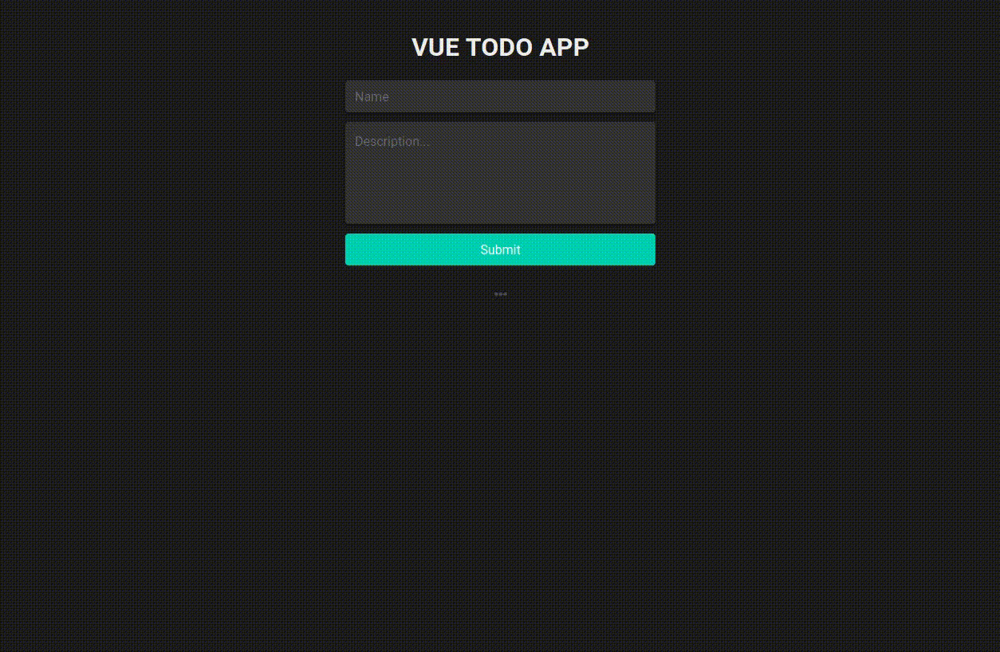

# Vue todo app

Todo app created with Vue.js & Django REST framework.



# Backend

## Project setup

```
pipenv shell
```

```
pipenv install
```

```
python manage.py migrate
```

```
python manage.py runserver
```

# Frontend

## Project setup
```
yarn install
```

### Compiles and hot-reloads for development
```
yarn serve
```

### Compiles and minifies for production
```
yarn build
```

### Lints and fixes files
```
yarn lint
```

### Customize configuration
See [Configuration Reference](https://cli.vuejs.org/config/).
